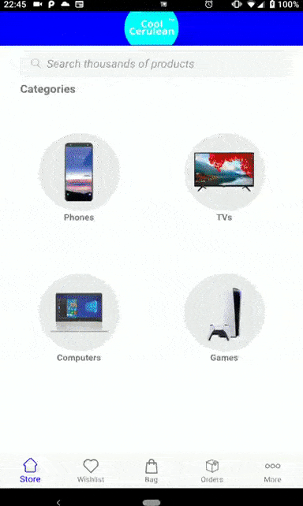

# Cool Cerulean

Cool Cerulean is a point of sales application for Android

  - Fetch API JSON
  - Display products present in the API
  - Product images!
  - Product features!

### Tech

Cool Cerulean relies on some technologies to work:

* Kotlin
* AndroidX
* Retrofit2
* GSON
* Espresso
* JUnit
* Mockito

### Development Remarks

- 1 hour for mockup design
- Around 4 hours to complete the MVP and 2 hours more for tunes, testing and refactoring
- 5 cans of RedBull consumed
- 8 bottles of water

### Preview

### Todos

 - Write MORE Tests
 - Test on more real devices
 - Add Night Mode
 - Add AR/XR visualization of products
 - Sleep

